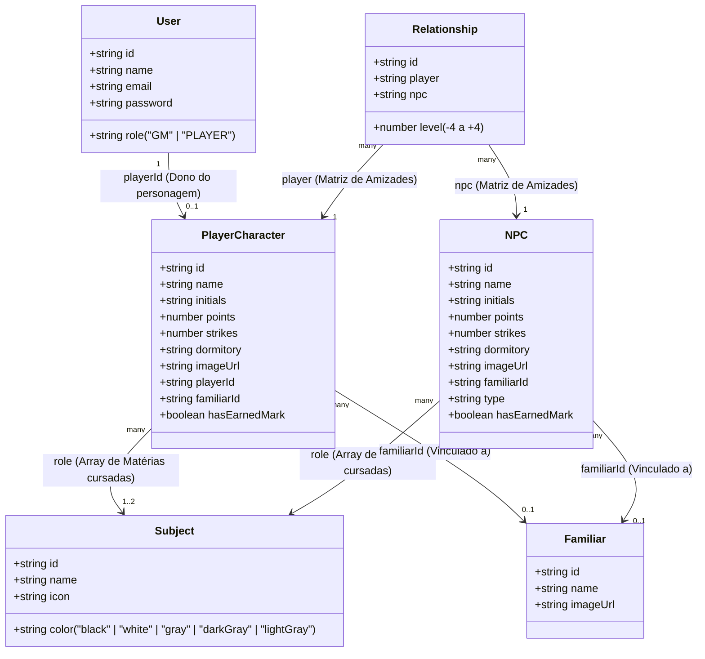

# ⚔️ Academia Aequilibrium — Painel do Mestre

> Painel de controle em tempo real para mestre de RPG de mesa — **DESEQUILÍBRIO**.
> Desenvolvido com React, TypeScript e Vite. Design: Dark Mode estrito com glassmorphism.

<p align="center">
  
  
  
</p>

---

## 🎲 Sobre o Projeto

A **Academia Aequilibrium** é um painel web criado para a **Mestre** gerenciar uma sessão de RPG. Centraliza o controle de personagens (jogadores e NPCs), pontuação, marcas de falha, familiares e a matriz de relacionamentos entre todos os envolvidos.

---

## ✨ Recursos

### 👥 Gerenciamento de Jogadores
- Suporte para até **8 slots de jogadores** simultâneos.
- Controle de **pontos em tempo real**, permitindo ao mestre incrementar ou decrementar valores com rapidez durante a sessão.

### 💀 Sistema de Punição
- **Valores negativos são permitidos**, refletindo penalidades severas para os personagens.
- Adição automática de **Marcas de Falha (strikes)** quando os pontos de um jogador atingem zero, mantendo o registro de consequências ao longo da campanha.

### 🖼️ Upload de Imagens
- Áreas de **drag-and-drop** dedicadas para o upload de:
  - Avatares dos personagens jogadores.
  - Avatares dos NPCs e familiares vinculados.
- Interface intuitiva que mantém a imersão visual da sessão.

### 🤝 Matriz de Amizades
- Rastreamento visual de **relacionamentos entre NPCs e Jogadores**.
- Escala de **-4 a +4 níveis de intensidade** (de profundo ódio a grande amigo), permitindo ao mestre monitorar alianças, rivalidades e laços de forma rápida e intuitiva.

---

## 🔐 Autenticação e Fluxo de Acesso

O sistema possui tela de **login obrigatório** antes do acesso ao painel.

### Contas de Desenvolvimento (mockadas no Front-end)

| Usuário      | Senha     | Papel  |
|--------------|-----------|--------|
| MestreMaria  | Colapso   | GM     |
| Duda         | rpg123    | PLAYER |
| Pablo        | rpg123    | PLAYER |
| Luis         | rpg123    | PLAYER |
| JP           | rpg123    | PLAYER |
| Gusta        | rpg123    | PLAYER |
| Gabriel      | rpg123    | PLAYER |

> **Regra de login por papel:**
> - **GM (MestreMaria)**: acessa o painel completo imediatamente após autenticar.
> - **PLAYER**: após autenticar com sua conta, o sistema verifica se existe um `PlayerCharacter` com `playerId` igual ao `id` do usuário logado. Enquanto não houver vínculo, o jogador vê a tela de espera. O painel só é liberado quando a GM criar e vincular o personagem ao seu usuário via modal de criação.

### Estrutura do `User`

```typescript
interface User {
  id: string;          
  name: string;        
  email: string;       
  password: string;    
  role: "GM" | "PLAYER";
}
```

---

## 🎭 Permissões por Papel (Role-Based Access)

| Ação                                    | GM  | PLAYER               |
|-----------------------------------------|-----|----------------------|
| Ver todos os PlayerCards                | ✅  | ✅                   |
| Editar pontos dos jogadores             | ✅  | ❌ (somente leitura) |
| Adicionar / Excluir jogadores           | ✅  | ❌                   |
| Ver todos os NPCs                       | ✅  | ✅                   |
| Adicionar / Excluir NPCs               | ✅  | ❌                   |
| Ver **toda** a Matriz de Amizade        | ✅  | ❌ (só a própria linha) |
| Editar amizades de qualquer jogador     | ✅  | ❌                   |
| Editar **própria** amizade com NPCs     | ✅  | ✅                   |
| Acessar Painel Administrativo           | ✅  | ❌                   |
| Alterar status de `hasEarnedMark`       | ✅  | ❌                   |

---

## 📁 Estrutura do Projeto

```
src/
├── data/
│   ├── types.ts            # Contratos de dados (interfaces TypeScript)
│   └── initialData.ts      # Contas mockadas, matérias estáticas e estados iniciais
├── app/
│   ├── context/
│   │   └── AuthContext.tsx  # Provider de autenticação + activeCharacterId
│   ├── components/
│   │   ├── auth/           # LoginScreen
│   │   ├── layout/         # Header
│   │   ├── player/         # PlayerCard
│   │   ├── npc/            # NpcCard + FriendshipMatrix
│   │   └── shared/         # AddCharacterModal, AdminModal, AvatarDropzone, YinYang
│   └── App.tsx             # Componente raiz: state global + roteamento de seções
├── utils/
│   └── subjectUtils.ts     # Lógica de fusão de cores (Yin-Yang) das matérias
└── main.tsx
```

---

## 🎨 Design System

| Papel              | Cor                                  |
|--------------------|--------------------------------------|
| Fundo Principal    | `#0a0a0a` — Preto profundo           |
| Superfície (card)  | `#111111` / `#1a1a1a` — Cinza escuro |
| Texto & Bordas     | `#ffffff` / `#a1a1aa` — Branco e Cinza |
| Destaque & Alerta  | `#c8102e` — Vermelho                 |

---

## 🏗️ Arquitetura e Contratos de API

Esta seção descreve a arquitetura de entidades do front-end, seus relacionamentos e o mapeamento dos contratos de API necessários para a integração completa com o Back-end.

---

### 1. 📊 Diagrama de Relacionamentos (Mermaid)

O diagrama de classes abaixo ilustra as entidades definidas no arquivo de contratos [types.ts](file:///c:/Users/Gusta/Documents/GitHub/rpg-desequilibrio-painel-do-mestre/src/data/types.ts), seus atributos cruciais e as relações existentes:



> **Campos Vitais Destacados:**
> - **`hasEarnedMark`** (booleano): Inicializado como `false`. Indica se as Marcas de Disciplina do personagem devem ser exibidas. Controlado pelo GM.
> - **`familiarId`** (string): Referência ao familiar associado. O valor especial `"none"` é usado quando não há familiar.
> - **`role`** (Subject[]): Array contendo de 1 a 2 matérias. A classe/arquétipo textual livre foi eliminada; tudo é derivado das disciplinas cursadas.
> - **`strikes`** (number): Contador de marcas de falha (limite de 0 a 4).
> - **`points`** (number): Pontos de HP/Sanidade. Podem assumir valores negativos.
> - **Matriz de Amizades ([Relationship](file:///c:/Users/Gusta/Documents/GitHub/rpg-desequilibrio-painel-do-mestre/src/data/types.ts#L36-L44))**: Estrutura de relacionamento muitos-para-muitos conectando `PlayerCharacter` e `NPC`.

---

### 2. 🗺️ Mapeamento de Funcionalidades (Endpoints Esperados)

A tabela a seguir apresenta todas as operações efetuadas pelo Front-end e que necessitam de correspondência no Back-end:

| Funcionalidade / Ação do Front-end | Método HTTP | Rota da API | Payload (Request Body) / Parâmetros | Regras de Negócio e Efeitos Colaterais no Back-end |
| :--- | :---: | :--- | :--- | :--- |
| **Autenticação (Login)** | `POST` | `/auth/login` | `{ "email", "password" }` | Autentica a sessão do usuário. Retorna o token de acesso (JWT) e dados do `User`. |
| **Criação de Usuário (Player)** | `POST` | `/admin/users` | `{ "name", "email", "password", "role": "PLAYER" }` | Cria uma nova conta para jogador no sistema (restrito a GM). |
| **Listar Jogadores do Sistema** | `GET` | `/admin/users` | N/A | Exibe todos os usuários cadastrados na tela de administração. |
| **Listar Familiares Cadastrados** | `GET` | `/admin/familiars` | N/A | Retorna todos os familiares existentes. |
| **Cadastrar Familiar** | `POST` | `/admin/familiars` | `{ "name", "imageUrl" }` | Adiciona um novo familiar no catálogo de entidades (restrito a GM). |
| **Listar Personagens Jogadores** | `GET` | `/characters/players` | N/A | Retorna a lista de todos os `PlayerCharacter` cadastrados com suas respectivas matérias cursadas (`role`). |
| **Criar Personagem Jogador** | `POST` | `/characters/players` | `{ "name", "initials", "dormitory", "playerId", "familiarId", "role": ["subj-ids"], "hasEarnedMark": false }` | Cria um personagem vinculado a um `User`. **Efeito Colateral:** O back-end deve gerar automaticamente registros na tabela `Relationship` com nível `0` (Neutro) entre este novo jogador e todos os NPCs atualmente ativos. |
| **Excluir Personagem Jogador** | `DELETE` | `/characters/players/:id` | N/A | Exclui o personagem de forma definitiva. **Efeito Colateral:** Remove em cascata todos os relacionamentos em `Relationship` associados a ele. |
| **Listar NPCs** | `GET` | `/characters/npcs` | N/A | Retorna a lista de todos os `NPC` do painel. |
| **Criar NPC** | `POST` | `/characters/npcs` | `{ "name", "initials", "dormitory", "familiarId", "role": ["subj-ids"], "type", "hasEarnedMark": false }` | Cria um NPC. **Efeito Colateral:** O back-end deve gerar automaticamente registros na tabela `Relationship` com nível `0` (Neutro) entre este novo NPC e todos os `PlayerCharacter` ativos. |
| **Excluir NPC** | `DELETE` | `/characters/npcs/:id` | N/A | Exclui o NPC de forma definitiva. **Efeito Colateral:** Remove em cascata todos os relacionamentos em `Relationship` associados a ele. |
| **Edição de Pontos (HP/Sanidade)** | `PATCH` | `/characters/players/:id` ou `/characters/npcs/:id` | `{ "points": number }` | Atualiza a quantidade de pontos do personagem. Aceita valores negativos. No front, cruzar de positivo para `<= 0` incrementa automaticamente 1 strike. |
| **Adição de Marcas de Falha (Strikes)** | `PATCH` | `/characters/players/:id` ou `/characters/npcs/:id` | `{ "strikes": number }` | Altera a contagem de marcas de falha. A validação deve limitar o valor de `0` a `4`. |
| **Conceder/Remover Marca (`hasEarnedMark`)** | `PATCH` | `/characters/players/:id` ou `/characters/npcs/:id` | `{ "hasEarnedMark": boolean }` | Concede ou remove a exibição das marcas ganhas (exclusivo do GM). |
| **Vincular Familiar Dinamicamente** | `PATCH` | `/characters/players/:id` ou `/characters/npcs/:id` | `{ "familiarId": string }` | Vincula dinamicamente um familiar (através do ID) ou desvincula (passando `"none"`). |
| **Alterar Amizade na Matriz** | `PATCH` | `/relationships/:id` | `{ "level": number }` | Atualiza o relacionamento. **Regra de Validação:** O valor de `level` deve estar estritamente entre `-4` e `+4`. Jogadores só editam os relacionamentos do próprio personagem. |
| **Listar Relacionamentos (Matriz)** | `GET` | `/relationships` | N/A | Retorna a lista plana de relacionamentos para renderização da matriz. |
| **Listar Matérias (Seed)** | `GET` | `/subjects` | N/A | Retorna o catálogo fixo de matérias cadastradas no banco (dados estáticos seedados). |
| **Carregar Sessão Consolidada** | `GET` | `/session` | N/A | Retorna `{ players, npcs, relationships }` em chamada única para hidratação inicial do painel. |

---

### ⚠️ Estado de Integração

> **AVISO IMPORTANTE:** Os dados dinâmicos iniciais foram completamente removidos do front-end.
> As constantes `INITIAL_PLAYERS`, `INITIAL_NPCS`, `INITIAL_FAMILIARS` e `INITIAL_RELATIONSHIPS`
> são agora **arrays vazios `[]`**. O painel inicia completamente em branco e depende
> integralmente das chamadas de API reais para popular as listas de personagens, familiares
> e relacionamentos. Apenas as contas de usuário (`mockUsers`) e as matérias (`mockSubjects`)
> permanecem mockadas até a integração da autenticação e do seed de matérias.

---

### 📋 Detalhes das Entidades (Contratos TypeScript)

Esta subseção detalha a estrutura de objetos trocada por cada entidade em endpoints individuais:

#### 1. 📚 Matérias (`SubjectProps`) — Dados Estáticos

As matérias são o **catálogo fixo de disciplinas do sistema**, definidas como seed no back-end. O front-end **não cria nem edita** matérias em runtime — apenas as consome.

```typescript
interface SubjectProps {
  id: string;          // ex: "subj-05"
  name: string;        // ex: "Sonho"
  color: "black" | "white" | "gray" | "darkGray" | "lightGray";
  icon?: string;       
}
```

**Endpoint sugerido:** `GET /subjects` → retorna `SubjectProps[]`

> **Nota:** O campo `color` é um token semântico (não uma cor CSS arbitrária). O front-end usa esse valor para calcular a cor do avatar Yin-Yang via `getBlendedColor()` em `subjectUtils.ts`. O back-end deve respeitar os valores do enum exatamente como definidos.

---

#### 2. 🧙 PlayerCharacter (Personagem do Jogador)

> **MUDANÇA CRÍTICA — Sem "Classe/Arquétipo":**
> O campo `role: string` (que representava classe como "Ranger", "Mago" etc.) **não existe mais**.
> A propriedade `role` é agora um **array de objetos `SubjectProps[]`**, representando as matérias cursadas pelo personagem (mínimo 1, máximo 2).

```typescript
interface PlayerCharacter {
  id: string;
  name: string;
  initials: string;        
  points: number;          
  strikes: number;         
  dormitory: string;       
  imageUrl?: string;       
  role: SubjectProps[];    
  playerId: string;        
  familiarId: string;      
  hasEarnedMark: boolean;  
}
```

##### Tabela Descritiva dos Campos:

| Campo | Tipo | Descrição |
|-------|------|-----------|
| `id` | `string` | Identificador único do personagem. |
| `name` | `string` | Nome do personagem. |
| `initials` | `string` | Iniciais do personagem (usadas na UI). |
| `points` | `number` | Pontos do personagem em tempo real. |
| `strikes` | `number` | Quantidade de Marcas de Falha (limite de 4). |
| `dormitory` | `string` | Dormitório do personagem (ex: "Torre Norte"). |
| `imageUrl` | `string` (opcional) | URL da imagem do avatar. |
| `role` | `SubjectProps[]` | Array contendo as matérias cursadas (1 a 2). |
| `playerId` | `string` | ID do usuário (`User`) dono do personagem. |
| `familiarId` | `string` | ID do familiar de suporte vinculado (ou `"none"`). |
| `hasEarnedMark` | `boolean` | Indica se o personagem conquistou a exibição de suas Marcas de Disciplina. |

**Exemplo de payload JSON (resposta da API):**

```json
{
  "id": "char-abc123",
  "name": "Sylvara Nightwhisper",
  "initials": "SN",
  "points": 25,
  "strikes": 0,
  "dormitory": "Torre Norte",
  "imageUrl": null,
  "role": [
    {
      "id": "subj-05",
      "name": "Sonho",
      "color": "white"
    },
    {
      "id": "subj-09",
      "name": "Magia (Luz)",
      "color": "white"
    }
  ],
  "playerId": "user-duda",
  "familiarId": "fam-xyz789",
  "hasEarnedMark": false
}
```

##### Regras de negócio:
- Máximo de **8 jogadores** ativos (`MAX_PLAYERS = 8`).
- Quando `points` cruza de positivo para `<= 0`, o front-end **automaticamente adiciona 1 strike**. O back-end deve persistir esse valor atualizado.
- `strikes` é limitado a `MAX_STRIKES = 4`.
- O campo `playerId` é obrigatório e deve referenciar um `User` com `role: "PLAYER"`. Constraint `UNIQUE` necessária: um `User` pode ter no máximo **um** `PlayerCharacter` ativo.
- **Regra de Negócio de `hasEarnedMark`:** O campo `hasEarnedMark` deve ser inicializado como `false` por padrão ao criar um novo personagem.
- **Persistência de `hasEarnedMark`:** Este campo é vital para o storytelling da sessão e deve ser persistido em requisições de `PATCH`. Apenas o papel "GM" tem permissão para alterar o status de `hasEarnedMark`.

**Payload de criação (POST):**

```json
{
  "name": "Sylvara Nightwhisper",
  "initials": "SN",
  "dormitory": "Torre Norte",
  "playerId": "user-duda",
  "familiarId": "fam-xyz789",
  "role": ["subj-05", "subj-09"],
  "hasEarnedMark": false
}
```

> No payload de criação, `role` pode ser enviado como `string[]` de IDs. O back-end popula os objetos completos na resposta.

---

#### 3. 👻 NPC (Personagem Não Jogável)

Estrutura idêntica ao `PlayerCharacter`, exceto:
- **Sem `playerId`** (NPCs não pertencem a um usuário).
- Possui campo `type?: string` para categorização (ex: "Professor", "Guardião").
- O `role` também é `SubjectProps[]` — nunca uma string.

```typescript
interface NPC {
  id: string;
  name: string;
  initials: string;
  points: number;
  strikes: number;
  dormitory: string;
  imageUrl?: string;       
  role: SubjectProps[];    
  familiarId: string;
  type?: string;
  hasEarnedMark: boolean;  
}
```

##### Tabela Descritiva dos Campos:

| Campo | Tipo | Descrição |
|-------|------|-----------|
| `id` | `string` | Identificador único do NPC. |
| `name` | `string` | Nome do NPC. |
| `initials` | `string` | Iniciais do NPC. |
| `points` | `number` | Pontos do NPC. |
| `strikes` | `number` | Quantidade de Marcas de Falha (limite de 4). |
| `dormitory` | `string` | Dormitório do NPC. |
| `imageUrl` | `string` (opcional) | URL da imagem do avatar. |
| `role` | `SubjectProps[]` | Array contendo as matérias cursadas (1 a 2). |
| `familiarId` | `string` | ID do familiar de suporte vinculado (ou `"none"`). |
| `type` | `string` (opcional) | Categoria/função do NPC (ex: "Professor", "Guardião"). |
| `hasEarnedMark` | `boolean` | Indica se o NPC conquistou a exibição de suas Marcas de Disciplina. |

**Regras de negócio:**
- **Regra de Negócio de `hasEarnedMark`:** O campo `hasEarnedMark` deve ser inicializado como `false` por padrão ao criar um novo NPC.
- **Persistência de `hasEarnedMark`:** Este campo é vital para o storytelling da sessão e deve ser persistido em requisições de `PATCH`. Apenas o papel "GM" tem permissão para alterar o status de `hasEarnedMark`.

---

#### 4. 🦊 Familiar

```typescript
interface Familiar {
  id: string;
  name: string;
  imageUrl?: string;
}
```

> Familiares são criados pelo GM via painel Admin e vinculados a personagens pelo campo `familiarId`. O front-end usa o ID `"none"` como sentinela quando nenhum familiar está associado.

---

#### 5. 🤝 Matriz de Amizade (Relationship)

A matriz de amizade é uma **tabela associativa** (relação muitos-para-muitos) que mapeia a relação de cada NPC com cada PlayerCharacter.

```typescript
interface Relationship {
  id: string;
  player: string;   
  npc: string;      
  level: number;    
}
```

##### Escala de Níveis de Amizade:

| Valor | Rótulo                |
|-------|-----------------------|
| `-4`  | 💀 Profundo ódio      |
| `-3`  | 😠 Inimigo            |
| `-2`  | 😒 Não gosta          |
| `-1`  | 😑 Não vai com a cara |
| ` 0`  | 😐 Neutro             |
| `+1`  | 🙂 Colega             |
| `+2`  | 😊 Parceiro           |
| `+3`  | 😄 Amigo              |
| `+4`  | 🌟 Grande Amigo       |

##### Permissões de Visão da Matriz:
- **O GM** visualiza e edita a matriz completa de **todos** os jogadores versus todos os NPCs.
- **O PLAYER** visualiza **apenas a própria linha de amizade** (o relacionamento do *seu* personagem com cada NPC). O front-end filtra por `activeCharacterId`. O PLAYER possui permissão para editar os próprios pontos de amizade com os NPCs.

##### Regras de negócio da Matriz:
- **Cruzamento Total (N x M):** A matriz de amizades é gerada pelo cruzamento completo de **todos os NPCs** com **todos os PlayerCharacters**.
- **Criação de NPC:** Ao criar um **novo NPC**, o back-end deve gerar automaticamente um relacionamento com nível `0` (Neutro) para **cada `PlayerCharacter` ativo**.
- **Criação de PlayerCharacter:** Ao criar um **novo PlayerCharacter**, o back-end deve gerar automaticamente um relacionamento com nível `0` (Neutro) para **cada `NPC` ativo**.
- **Exclusão em Cascata:** Ao **excluir um PlayerCharacter**, todas as entradas de amizade desse personagem devem ser removidas em cascata do banco. Da mesma forma para NPCs.
- **Validação de Limites:** O `level` é sempre **inteiro** e **clampado entre -4 e +4** (tanto no front-end quanto com validação obrigatória no back-end).

---

#### 6. 🎨 Fusão Dinâmica de Cores (Yin-Yang) — Lógica de UI

Quando um personagem possui **duas matérias**, o front-end calcula automaticamente uma cor resultante mesclando as propriedades `color` das duas matérias para renderizar o avatar Yin-Yang bicolor. Esta lógica é **100% de responsabilidade do cliente** e está implementada em `src/utils/subjectUtils.ts`. **O back-end apenas retorna o array `role` com as matérias; nenhuma lógica de fusão visual deve ser persistida no banco.**

---

#### 7. 📦 Exemplo de Payload Completo (GET /session)

Abaixo está um exemplo de payload completo para recuperar o estado ativo de uma sessão de jogo. Ele reflete as novas regras, como os campos `role` mapeados como arrays de objetos `SubjectProps`, o vínculo via `playerId`/`familiarId` e a lista flat de relacionamentos.

```json
{
  "players": [
    {
      "id": "char-abc123",
      "name": "Sylvara Nightwhisper",
      "initials": "SN",
      "points": 25,
      "strikes": 0,
      "dormitory": "Torre Norte",
      "imageUrl": "https://example.com/avatar-sylvara.png",
      "role": [
        {
          "id": "subj-05",
          "name": "Sonho",
          "color": "white"
        },
        {
          "id": "subj-09",
          "name": "Magia (Luz)",
          "color": "white"
        }
      ],
      "playerId": "user-duda",
      "familiarId": "fam-xyz789",
      "hasEarnedMark": false
    }
  ],
  "npcs": [
    {
      "id": "npc-def456",
      "name": "Lady Seraphine",
      "initials": "LS",
      "points": 100,
      "strikes": 0,
      "dormitory": "Torre Sul",
      "imageUrl": "https://example.com/avatar-seraphine.png",
      "role": [
        {
          "id": "subj-03",
          "name": "Tempo",
          "color": "gray"
        }
      ],
      "familiarId": "fam-lm123",
      "type": "Professor",
      "hasEarnedMark": true
    }
  ],
  "relationships": [
    {
      "id": "rel-001",
      "player": "char-abc123",
      "npc": "npc-def456",
      "level": 3
    }
  ]
}
```

---

## 📜 Licença

Desenvolvido para uso interno de uma mesa de RPG.
Todos os direitos reservados — **RPG DESEQUILÍBRIO — Maria Rita Fernandes**.
